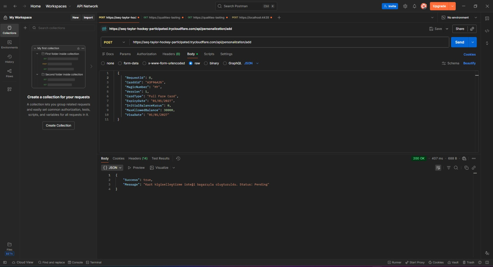
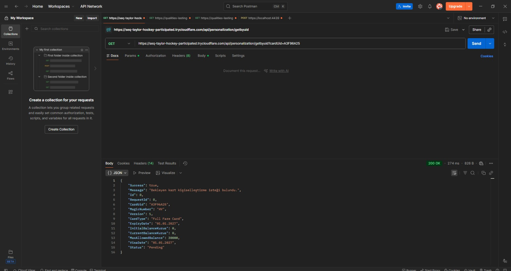
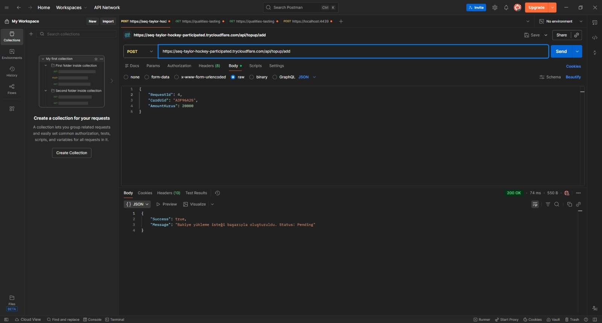
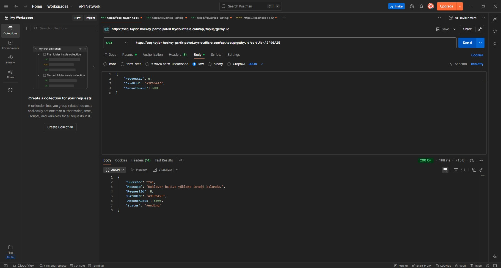
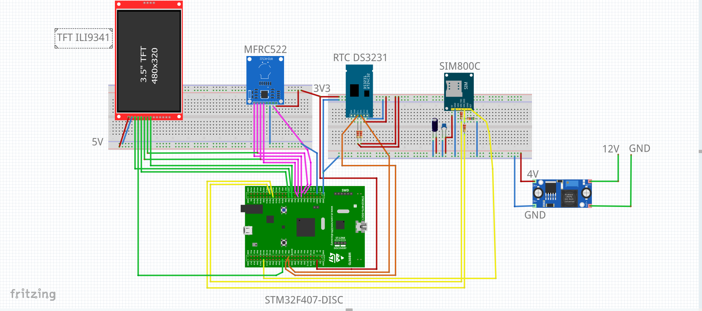
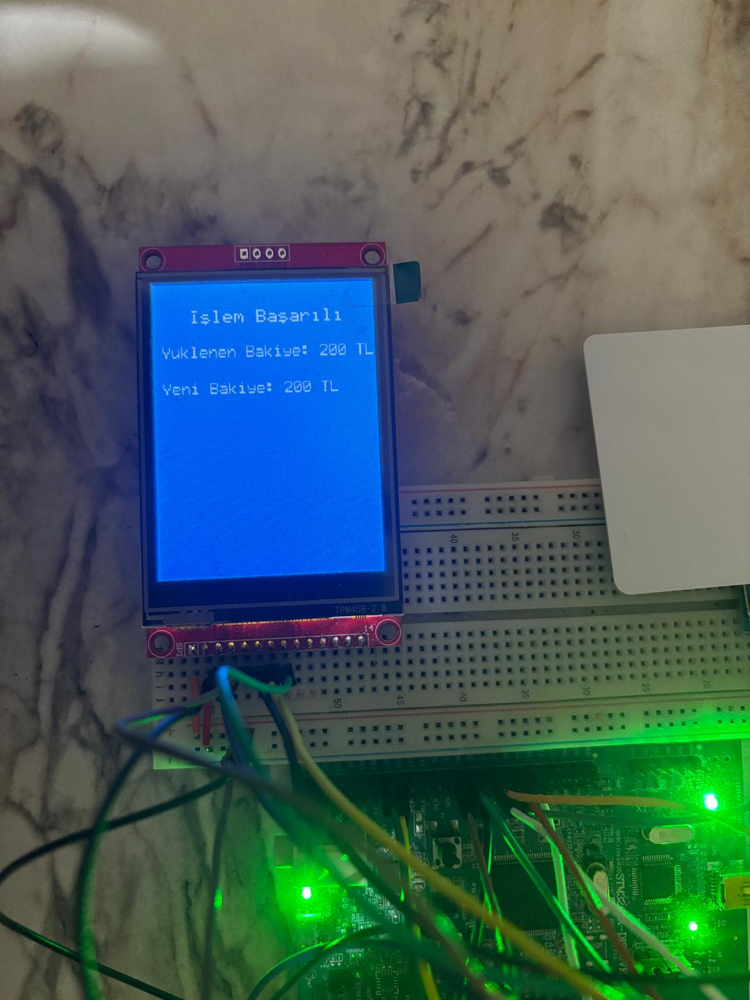
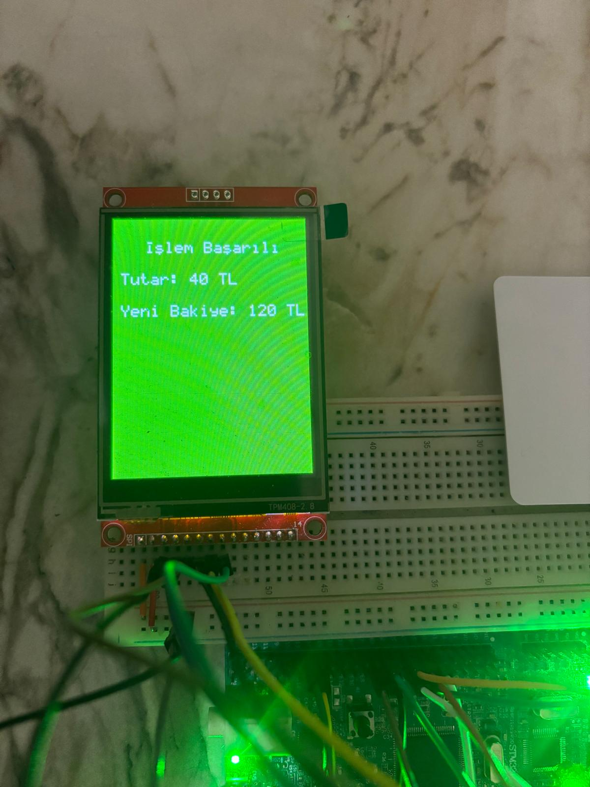

# STM32 NFC Card Reader & Balance Management System

STM32F407 tabanlı bu proje; **RC522 RFID/NFC kart okuyucu**, **SIM800C GSM/GPRS modülü**, **ILI9341 TFT ekran**, **DS3231 RTC** ve **FreeRTOS** kullanılarak geliştirilen gömülü bir kart okuma ve bakiye yönetim sistemidir.

Proje, toplu taşıma kart okuyucu mantığına benzer şekilde çalışır. Sistem; yeni kartları algılar, kart bilgilerini sunucudan alır, MIFARE kart bloklarına güvenli şekilde yazar, kayıtlı kartlarda bakiye/tarife kontrolü yapar, yükleme isteği varsa kart bakiyesini günceller ve işlem sonucunu tekrar API servisine bildirir.

> Bu README, projenin genel mimarisini ve çalışma mantığını anlatır. API servisi projede destekleyici/test backend olarak kullanılmıştır; ana odak STM32 gömülü yazılım tarafıdır.

---

## Genel Bakış

Bu sistemde STM32, kart okuyucu cihazın ana kontrol birimi olarak çalışır. RC522 modülü ile MIFARE kart okunur/yazılır, SIM800C üzerinden HTTP GET/POST istekleri yapılır, DS3231 RTC ile zaman bilgisi alınır ve ILI9341 TFT ekran üzerinden kullanıcıya işlem durumu gösterilir.

Temel senaryolar:

- Yeni kart algılama
- Kart UID bilgisini API servisine gönderme
- API’den gelen kart kişiselleştirme bilgilerini MIFARE karta yazma
- Kayıtlı kartlarda bakiye ve tarife kontrolü yapma
- Kart için bekleyen bakiye yükleme isteğini sorgulama
- Bakiye yükleme sonucunu karta ve API’ye bildirme
- Kartta yapılan ücret çekim ve zamanlarını API'ye bildirme.
- İşlem sonucunu TFT ekranda gösterme

---

## Kullanılan Teknolojiler

### Gömülü Yazılım

- STM32F407VET6 / STM32F4 serisi
- STM32CubeIDE
- C
- **Bare-metal embedded programming yaklaşımı**
- **Register-level peripheral initialization**
- **Custom low-level driver development**
- FreeRTOS task/queue/mutex mimarisi
- SPI, I2C, USART, DMA, Timer, GPIO
- Interrupt, timeout ve donanım durum bayrağı yönetimi

### Donanım Modülleri

- RC522 RFID/NFC okuyucu
- MIFARE Classic kart
- SIM800C GSM/GPRS modülü
- ILI9341 TFT LCD
- DS3231 RTC modülü
- 12VDC/4VDC LDO

### Backend / Test Servisi

- C#
- ASP.NET Web API
- SQL Server
- Postman ile endpoint testleri

---

## Bare-Metal ve FreeRTOS Yaklaşımı

Bu projede düşük seviye donanım altyapısı, STM32 çevresel birimlerinin doğrudan register seviyesinde yapılandırılmasıyla geliştirilmiştir. GPIO, SPI, I2C, USART, DMA, Timer ve interrupt ayarları sadece hazır örnek kodlara bağlı kalmadan, STM32F4 çevresel birimlerinin çalışma mantığı dikkate alınarak hazırlanmıştır.

FreeRTOS, bu düşük seviye bare-metal altyapı üzerine entegre edilmiştir. Böylece donanım sürücüleri register-level yapıda korunurken, uygulama seviyesi RFID okuma, SIM800C HTTP haberleşmesi, RTC zaman yönetimi ve TFT ekran güncelleme görevleri ayrı task yapılarıyla yönetilmiştir.

```text
Register-Level Peripheral Init
        │
        ▼
Custom Bare-Metal Drivers
        │
        ▼
FreeRTOS Task / Queue Architecture
        │
        ▼
RFID + GSM + RTC + TFT Application Flow
```

---

## Temel Özellikler

### STM32 Firmware

- STM32 çevresel birimlerinin register seviyesinde başlatılması ve kontrol edilmesi
- Bare-metal seviyede GPIO, SPI, I2C, USART, DMA, Timer ve interrupt yapılandırmaları
- FreeRTOS öncesi düşük seviye sürücü altyapısının oluşturulması
- FreeRTOS sonrası task/queue/mutex tabanlı uygulama mimarisine geçilmesi
- RC522 ile kart algılama, UID okuma ve MIFARE blok okuma/yazma
- MIFARE kart üzerinde proje kimliği için `Magic Number` kontrolü
- Kart durum sınıflandırması:
  - Yeni kart
  - Sisteme kayıtlı kart
  - Geçersiz/yabancı kart
- Kart kişiselleştirme işlemi
- Kart bakiyesi, maksimum bakiye, vize tarihi ve işlem sayaçlarının kart bloklarında tutulması
- CRC16 ile kart verisi bütünlük kontrolü
- SIM800C ile GPRS bağlantısı ve HTTP GET/POST işlemleri
- API’den gelen JSON cevaplarının manuel parse edilmesi
- FreeRTOS task/queue mimarisi
- TFT ekranda saat, tarih, bakiye, yüklenen tutar ve işlem sonucu gösterimi
- RTC DS3231 ile gerçek zamanlı tarih/saat takibi
- SPI ortak kullanımı için mutex yaklaşımı

### API Servisi

API servisi, STM32 cihazının test ve demo sürecinde haberleştiği backend olarak kullanılmıştır. Bu servis üzerinden kart bilgisi sorgulama, bakiye yükleme isteği oluşturma ve işlem durumlarını güncelleme gibi temel işlemler yapılır.

---

## Sistem Mimarisi

```text
┌─────────────────────┐
│     MIFARE Card      │
└──────────┬──────────┘
           │ RF
           ▼
┌─────────────────────┐       SPI        ┌─────────────────────┐
│     RC522 RFID       │◀──────────────▶│      STM32F407      │
└─────────────────────┘                  │                     │
                                         │  FreeRTOS Tasks     │
┌─────────────────────┐       I2C        │  - RFID Task        │
│     DS3231 RTC       │◀──────────────▶│  - SIM800C Task     │
└─────────────────────┘                  │  - Timer/RTC Task   │
                                         │  - TFT LCD Task     │
┌─────────────────────┐       SPI        │                     │
│    ILI9341 TFT       │◀──────────────▶│                     │
└─────────────────────┘                  └──────────┬──────────┘
                                                    │ USART + AT Commands
                                                    ▼
                                         ┌─────────────────────┐
                                         │      SIM800C        │
                                         │     GPRS / HTTP     │
                                         └──────────┬──────────┘
                                                    │ HTTP GET / POST
                                                    ▼
                                         ┌─────────────────────┐
                                         │  ASP.NET Web API    │
                                         │  SQL Server Backend │
                                         └─────────────────────┘
```

---

## FreeRTOS Görev Yapısı

Projede işlemler birbirinden ayrılmış task yapılarıyla yönetilir.

| Task | Görev |
|---|---|
| `vRFID_TASK` | Kart algılama, UID okuma, kart tipi belirleme, MIFARE okuma/yazma, bakiye ve işlem kontrolü |
| `vSIM800C_Task` | HTTP GET/POST işlemleri, API haberleşmesi, JSON cevaplarının işlenmesi |
| `vTimer_Service_Task` | DS3231 RTC’den tarih/saat okuma ve ilgili kuyruklara aktarma |
| `vTFT_LCD_Task` | TFT ana ekranı, saat/tarih güncelleme ve kart işlem sonucunu ekranda gösterme |

Task’lar arasında veri aktarımı için FreeRTOS queue yapıları kullanılır:

```text
RFID Task  ── card UID / request type ──▶ SIM800C Task
RFID Task  ◀─ new card info / topup info ─ SIM800C Task
RFID Task  ── card result info ─────────▶ TFT Task
RTC Task   ── date/time ────────────────▶ RFID Task + TFT Task
```

---

## Kart Hafıza Yapısı

Kart bilgileri MIFARE Classic kartın belirli bloklarında tutulur.

### Sector 1 / Block 0 — Card Header

```c
typedef struct PACKED_STRUCT {
    uint8_t magic_number[2];
    uint8_t version;
    RC522_Card_Type card_type;
    uint8_t uid[4];
    uint32_t operation_counter;
    uint16_t expiry_date;
    uint16_t crc;
} RC522_Card_Header;
```

Bu blokta kartın projeye ait olup olmadığı, kart tipi, UID, işlem sayacı, son kullanma tarihi ve CRC bilgisi tutulur.

### Sector 1 / Block 1 — Balance Info

```c
typedef struct PACKED_STRUCT {
    uint32_t balance;
    uint32_t operation_counter;
    uint32_t max_balance;
    uint16_t visa_date;
    uint16_t crc;
} RC522_Card_Balance;
```

Bu blokta kart bakiyesi, bakiye işlem sayacı, maksimum bakiye limiti, vize tarihi ve CRC bilgisi tutulur.

### Sector 1 / Block 3 — Security Trailer

```c
typedef struct PACKED_STRUCT {
    uint8_t key_A[6];
    uint8_t access_bits[3];
    uint8_t general_purpose;
    uint8_t key_B[6];
} RC522_Card_Security;
```

Bu blokta MIFARE sektör güvenlik bilgileri tutulur.

---

## Çalışma Senaryosu

### 1. Sistem Başlatma

STM32 açıldığında önce temel donanımlar başlatılır:

1. FPU
2. Sistem clock
3. TIM6 zamanlayıcı
4. GPIO
5. I2C
6. SPI
7. USART + DMA
8. RC522
9. SIM800C + GPRS
10. DS3231 RTC
11. ILI9341 TFT
12. FreeRTOS scheduler

Tüm donanımlar hazır olduğunda FreeRTOS task’ları çalışmaya başlar.

---

### 2. Yeni Kart Kişiselleştirme

Yeni veya boş bir kart okutulduğunda sistem şu adımları izler:

1. RC522 kartı algılar.
2. UID bilgisi okunur.
3. Kartın ilgili bloğu okunur.
4. Magic Number kontrolü yapılır.
5. Kart boş ise `New_Card` olarak değerlendirilir.
6. Kart UID bilgisi SIM800C task’a gönderilir.
7. SIM800C, API servisine GET isteği gönderir.
8. API’den gelen kart bilgileri parse edilir.
9. Kart bilgileri MIFARE bloklarına yazılır.
10. İşlem sonucu API servisine POST edilir.
11. Sonuç TFT ekranda gösterilir.

```text
Card UID Read
      │
      ▼
GET /personalization/getbyuid?cardUid=...
      │
      ▼
Write Card Header + Balance Blocks
      │
      ▼
POST /personalization/update-status
      │
      ▼
Show Result on TFT
```

---

### 3. Kayıtlı Kart Okuma, Bakiye Yükleme ve Ücret Çekme

Kayıtlı bir kart okutulduğunda sistem önce kartın projeye ait olup olmadığını ve veri bütünlüğünü kontrol eder. Bunun için kart üzerindeki `Magic Number`, kart tipi, CRC, bakiye, maksimum bakiye limiti, vize tarihi ve işlem sayaçları değerlendirilir.

Kart geçerli ise sistem iki ana akış üzerinden ilerler. İlk olarak ilgili kart için API tarafında bekleyen bir bakiye yükleme isteği olup olmadığı sorgulanır. Bekleyen yükleme isteği varsa, tutar kart bakiyesine eklenir, kart üzerindeki bakiye bloğu güncellenir ve yükleme işleminin sonucu API servisine bildirilir.

Bekleyen yükleme isteği yoksa sistem kart tipine göre normal kullanım akışına geçer. Kart tipi ve mevcut bakiye bilgisine göre karttan belirlenen ücret düşülür. İşlem başarılı olursa yeni bakiye karta yazılır, işlem sayacı güncellenir ve ücret çekme işlemi; kart UID bilgisi, çekilen tutar, kalan bakiye ve RTC’den alınan işlem zamanı ile birlikte API servisine bildirilir. Yetersiz bakiye, geçersiz kart, vize süresi dolmuş kart veya CRC hatası gibi durumlarda işlem yapılmaz ve sonuç TFT ekranda kullanıcıya gösterilir.

```text
Registered Card Read
      │
      ▼
Read Header + Balance Blocks
      │
      ▼
Magic Number + CRC + Expiry/Visa + Balance Checks
      │
      ▼
GET /topup/getbyuid?cardUid=...
      │
      ├── Topup exists
      │       │
      │       ▼
      │   Add amount to card balance
      │       │
      │       ▼
      │   POST topup result to API
      │
      └── No topup
              │
              ▼
          Calculate fare by card type
              │
              ▼
          Deduct balance from card
              │
              ▼
          Send usage/transaction result to API
              │
              ▼
          Show Result on TFT
```

---

## SIM800C HTTP Haberleşmesi

SIM800C tarafında temel AT komut akışı şu mantıkla ilerler:

1. Modül başlatılır.
2. SIM ve şebeke durumu kontrol edilir.
3. GPRS bağlantısı açılır.
4. HTTP servisi başlatılır.
5. URL parametresi ayarlanır.
6. GET veya POST işlemi başlatılır.
7. `+HTTPACTION` sonucu beklenir.
8. `AT+HTTPREAD` ile cevap okunur.
9. Gelen JSON veri STM32 tarafında parse edilir.

Başarılı HTTP sonuçları için sistem özellikle şu cevapları kontrol eder:

```c
#define ANS_0_200 "0,200"   // HTTP GET success
#define ANS_1_200 "1,200"   // HTTP POST success
```

---

## API Endpoint Özeti

API servisi sadece demo/test backend olarak projeye eklenmiştir.

| İşlem | Method | Endpoint |
|---|---|---|
| Yeni kart bilgisi sorgulama | GET | `/api/personalization/getbyuid?cardUid=...` |
| Yeni kart işlem sonucunu güncelleme | POST | `/api/personalization/update-status` |
| Bakiye yükleme isteği sorgulama | GET | `/api/topup/getbyuid?cardUid=...` |
| Bakiye yükleme sonucunu güncelleme | POST | `/api/topup/update-status` |
| Test amaçlı kart kaydı oluşturma | POST | `/api/cards/add` |
| Test amaçlı bakiye yükleme isteği oluşturma | POST | `/api/topup/add` |

---

## Postman Testleri

Postman ile API servisinin temel endpoint testleri yapılmıştır. Aşağıdaki görsellerde kart kişiselleştirme isteği oluşturma, UID ile kart bilgisi sorgulama, bakiye yükleme isteği oluşturma ve UID ile bekleyen bakiye yükleme isteğini sorgulama akışları gösterilmektedir.

### Kart Kişiselleştirme Testleri





### Bakiye Yükleme Testleri





Örnek kart oluşturma isteği:

```json
{
  "cardUid": "AABBCCDD",
  "magicNumber": 18521,
  "version": 1,
  "cardType": 0,
  "expiryDate": "01/01/2027",
  "visaDate": "01/01/2027",
  "currentBalanceKurus": 0,
  "processOperationCounter": 0,
  "balanceOperationCounter": 0
}
```

Örnek bakiye yükleme isteği:

```json
{
  "requestId": 17,
  "cardUid": "AABBCCDD",
  "amountKurus": 5000,
  "status": 0
}
```

---

## Demo Video
https://github.com/user-attachments/assets/29436a0f-e0b2-4e96-8eec-04d78dfcce11


Video; sistemin açılışını, kart kişiselleştirme işlemini, API üzerinden bakiye yükleme isteği oluşturulmasını, kart okutulduğunda bakiyenin karta yazılmasını, kart tipine göre ücret düşülmesini ve TFT ekrandaki işlem sonuçlarını göstermektedir.

---

## Ekran Görüntüleri

### Donanım ve TFT Çıktıları







---

## Proje Dosya Yapısı

Repository yapısı:

```text
├── STM32_NFC_Card_Reader/
│   ├── Inc/
│   │   ├── app_tasks.h
│   │   ├── rc522.h
│   │   ├── sim800c.h
│   │   ├── tft_ili9341.h
│   │   ├── rtc_ds3231.h
│   │   ├── spi_driver.h
│   │   ├── i2c_driver.h
│   │   ├── usart_driver.h
│   │   └── helper_function.h
│   ├── Src/
│   │   ├── main.c
│   │   ├── app_tasks.c
│   │   ├── rc522.c
│   │   ├── sim800c.c
│   │   ├── tft_ili9341.c
│   │   ├── rtc_ds3231.c
│   │   ├── spi_driver.c
│   │   ├── i2c_driver.c
│   │   ├── usart_driver.c
│   │   └── helper_function.c
│   ├── Drivers/
│   ├── MiddleWares/
│   ├── Startup/
│   ├── STM32F407VETX_FLASH.ld
│   └── STM32F407VETX_RAM.ld
│
├── CardControlService/
│   ├── Controllers/
│   ├── Models/
│   ├── Repositories/
│   └── CardControlService.csproj
│
├── docs/
│   ├── demo.mp4
│   ├── circuit-diagram.jpg
│   ├── tft-main-screen.jpg
│   └── postman-images...
│
├── README.md
└── .gitignore
```

---

## Bu Projede Öne Çıkan Teknik Noktalar

- STM32 üzerinde register-level bare-metal driver geliştirme yaklaşımı
- FreeRTOS ile görev ayrımı ve queue tabanlı haberleşme
- SPI hattını RC522 ve TFT arasında kontrollü kullanma
- SIM800C ile gerçek HTTP haberleşmesi gerçekleştirme
- AT komut cevaplarını timeout ve paket mantığıyla yönetme
- MIFARE Classic kart bloklarına özel veri formatı yazma
- CRC ile kart verisi bütünlüğü kontrolü
- RTC tabanlı zaman yönetimi
- TFT üzerinde kullanıcıya işlem sonucu gösterme
- Kart tipine göre ücret düşme ve işlem sonucunu API’ye bildirme
- Gömülü sistem + backend servis entegrasyonu

---

## Geliştirici Notu

Bu proje, gömülü yazılım tarafında gerçek bir ürün akışını simüle etmek amacıyla geliştirilmiştir. Sadece kart UID okuyan basit bir RFID uygulaması değil; kart kişiselleştirme, bakiye yönetimi, GSM/GPRS üzerinden API haberleşmesi, TFT kullanıcı çıktısı ve FreeRTOS task mimarisi gibi birden fazla katmanı bir araya getiren uçtan uca bir sistemdir.

---

## Yazar

**Hüseyin Yanar**
